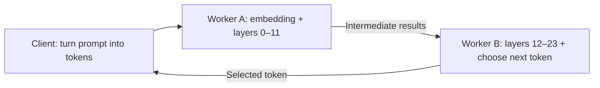
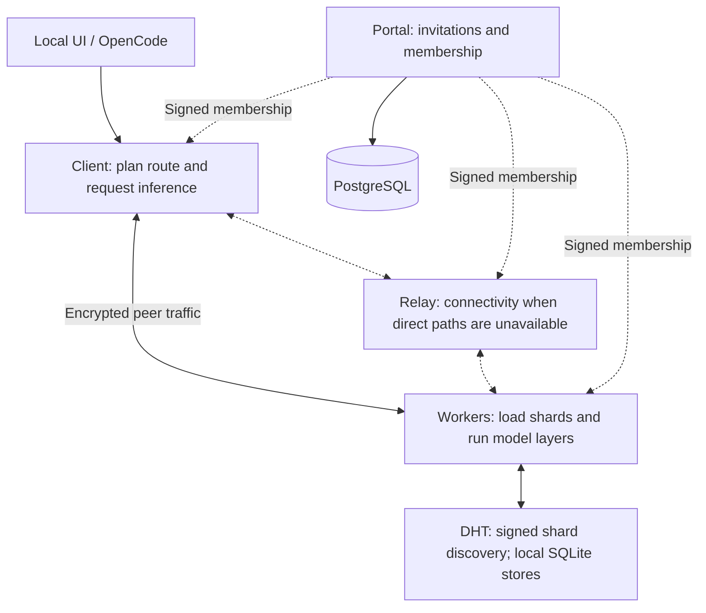

# Sangama

**Sangama (संगम)** means confluence: devices coming together to run one AI model.

Sangama is a Rust project that lets computers share the work of running a language model. Each participating computer loads a piece of the model and passes its results to the next computer.

**Today:** an experimental network for trusted, invited peers. Real Qwen inference works across workers, with encrypted connections, relay support, automatic loading of prepared shards, and a local UI. It is not yet a production-ready public network.

[Try it locally](#try-it-locally) · [Architecture](#architecture) · [Join a network](docs/admitted-mesh.md) · [Contribute](CONTRIBUTING.md)

## The goal

Make it practical to run open models across computers people already own—even when the whole model cannot fit on one device.

The long-term experience is simple: install a worker, choose how much memory to contribute, join a network, and let Sangama assign useful work. The current implementation proves the pieces with **Qwen2.5-0.5B-Instruct**, a small model used for testing. Arbitrary large Qwen models, Kimi and phones are future work.

Sharing a model can make it fit across devices. It does **not automatically make generation faster**: each extra network hop adds latency.

## How it works

A language model turns text into **tokens**—small pieces of text—and predicts the next token by passing numbers through a sequence of layers. Sangama divides those layers into **shards**, each stored and executed by a worker.

For the current two-worker Qwen setup:



1. Workers load their assigned shard files into memory.
2. The client checks that the workers cover the complete model, in the right order, and reserves them for the request.
3. Worker A processes the input and sends its intermediate results to Worker B.
4. Worker B finishes the computation and returns the next token.
5. The process repeats until the response is complete.

Weights stay loaded on the workers; they are not transferred for every token. Each worker also keeps its own conversation state, called a **KV cache**. A client using existing workers needs the tokenizer and model metadata, not the full model weights.

Want the basics in more depth? Read [LLM and P2P fundamentals](docs/fundamentals.md).

## Architecture

The system separates **who may join**, **how peers find and reach each other**, and **where the model runs**.



| Component | What it does |
|---|---|
| **Worker** | Contributes memory and compute; loads a prepared model shard and executes its layers. |
| **Client / local UI** | Checks capacity, allocates shards, verifies a ready route and runs inference. |
| **Portal + PostgreSQL** | Handles invitations, membership expiry, revocation and the device directory. |
| **DHT** | Shares signed advertisements about available shards. Each node stores discovery records locally in SQLite. |
| **Relay** | Helps admitted peers communicate when routers prevent direct connections. It does not run model layers. |
| **OpenCode integration** | Connects a coding-assistant interface to the local chat API. Currently text-only; tools and automatic edits are disabled. |

The allocator uses available memory, prepared shard files and measured probe latency to select workers. It does not yet download arbitrary models or create new shard boundaries automatically.

See [the detailed architecture](docs/architecture.md) for source files, request flows and security boundaries.

## What works today

- Real Qwen text generation using CPU or Apple Metal.
- Workers that load only their assigned physical shard files.
- Peer identity verification, single-use invitations, expiring membership and revocation.
- Encrypted libp2p connections, a controlled relay and signed DHT discovery.
- Memory-aware shard allocation, readiness checks and exclusive request reservations.
- Classic HTML operator pages and a local inference UI with worker status and placement controls.
- OpenCode connected to the local API without a hosted inference provider.

**Tested:** 23 isolated Docker checks, including real Qwen generation through the UI, forced relay connections, network delay, revoked members, disconnections and recovery into a new session. See [test results](docs/test-results/network-ui.md).

**Still to validate:** two actual computers on separate home networks and sustained real-world performance. Simulation results are not a guarantee for every router or Internet connection.

## Try it locally

You need stable Rust, Python 3, curl and your platform's native build tools. Run these commands from your repository checkout. Preparing the current checkpoint and shards uses about 2.25 GB of disk space; inference needs additional RAM.

```sh
# Download and verify the supported model; create its shard files.
python3 scripts/fetch-qwen.py

# Build the CPU worker and client.
./scripts/cargo build --release --locked

# Generate through two worker processes on this computer.
./target/release/sangama generate --device cpu \
  --prompt 'Explain peer-to-peer computing in one short sentence.' \
  --max-tokens 40
```

On an Apple Silicon Mac, build with `--features metal` and run with `--device metal` to use the GPU.

To open the local UI with the CPU build:

```sh
./target/release/sangama ui --device cpu
```

Open the private URL printed in the terminal. This local test runs both workers on one computer; it does not join a remote network.

For a quick test without downloading weights, run `./target/release/sangama demo`. That command uses a [numerical fixture](docs/numerical-fixture.md), not a language model.

## Join with another computer

An operator must deploy the membership portal and a reachable relay. Each peer then receives a network invitation, the authority public key and a worker configuration, prepares its shard files, and starts its worker.

**Registering a device on the website does not grant network access.** The worker must prove ownership of its peer identity and redeem a network invitation.

Follow [the invited-network guide](docs/admitted-mesh.md) and [UI workflow](docs/network-ui.md). Packaging for a DMG, shell installer and Windows executable is in development; signing, distribution and platform validation are not complete. See [worker packages](docs/distribution.md).

## Current limits

The supported model is pinned Qwen2.5-0.5B-Instruct, using F32 weights and greedy token selection. Workers currently serve one conversation at a time, and a route uses a matching backend type. Quantization, phone clients, arbitrary models and automatic shard downloads are not implemented.

If a worker disconnects, the active request fails. Recovery starts a new session; the old KV cache is not migrated automatically.

Use trusted participants. Encryption protects traffic in transit, but a worker can inspect the inference data it processes. Anonymous public participation needs further trust and abuse-resistance work.

## Explore or contribute

| Start here | What you will find |
|---|---|
| [Contributor guide](CONTRIBUTING.md) | Setup, source map, tests and useful first contributions |
| [Fundamentals](docs/fundamentals.md) | Tokens, weights, layers, KV caches and distributed inference |
| [Architecture](docs/architecture.md) | Components, protocols and execution lifecycle |
| [Network setup](docs/admitted-mesh.md) | Membership, relay configuration and managed workers |
| [Portal deployment](deploy/portal/README.md) | Hosted UI and private PostgreSQL |
| [Generation and verification](docs/generation.md) | Model files, generation and independent correctness checks |
| [OpenCode](docs/opencode.md) | Local coding-assistant integration |

The next milestone is a repeatable two-home-network test, followed by easier onboarding and measured improvements to performance and reliability.

### Installed coding-assistant command

After preparing the model, building Sangama, and running `./scripts/install-opencode.sh`:

```sh
python3 scripts/install-sangama-code.py
cd /path/to/your/project
sangama-code
```

This installs a user-level command on macOS/Linux. It starts local workers automatically and opens
OpenCode in the current directory. The current model supports text suggestions; file editing and tools
are disabled. See [installation and remote-worker options](docs/opencode.md).
