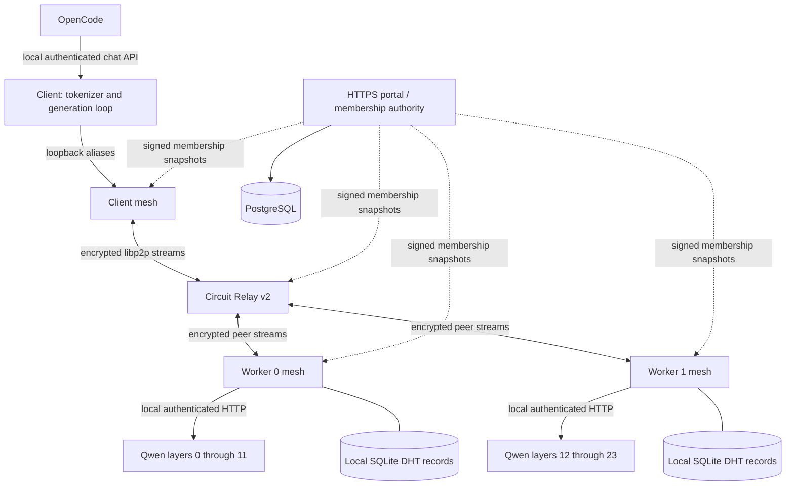

# Sangama architecture

Read [fundamentals](fundamentals.md) for the model concepts and [CONTRIBUTING](../CONTRIBUTING.md) for build/test commands. This page describes the implementation after the admitted-mesh changes, not an aspirational public network.

## Components and boundaries

The relay forwards encrypted peer traffic; it does not execute layers or own the model. Direct peer connections can replace relay paths when reachable. The worker-to-worker activation hop uses the same mesh transport. DHT traffic shares the peer network but carries signed discovery records, not inference tensors or weights.

There are two UIs: the local inference/discovery UI in `src/ui.rs` and the separate hosted directory portal in `portal/`. Directory registration is not cryptographic membership. The legacy UI/private-overlay DHT and the numerical fixture are separate from the admitted mesh.

## Model and files

The supported checkpoint is Qwen2.5-0.5B-Instruct revision `7ae557604adf67be50417f59c2c2f167def9a775`: 24 layers, width 896, 14 attention heads, two KV heads and tied input/output embeddings. Candle 0.11.0 executes F32 on CPU or Metal. All workers in a route currently use the same backend type.

`scripts/fetch-qwen.py` verifies the pinned download and partitions tensor data into physical safetensors files. The manifest names each shard, hash and exclusive layer range. It is not a generic model converter. Each worker reads only its assigned shard plus configuration/manifest. A client needs configuration, manifest and tokenizer. Optional `qwen-test` additionally requires the full checkpoint for an independent Candle baseline.

The two endpoint shards duplicate tied embeddings and are about 630 MB each on disk. Runtime admission estimates F32 weights, KV state and workspace against available memory and configured budgets. Linux cgroup limits are included; Mac unified memory is counted once. This is conservative admission, not a guarantee that every workload can never exhaust memory.

## Lifecycle: invitation to ready route

1. **Identity:** `mesh-identity` creates a persistent Ed25519 identity. Protect the private key; the peer ID/public key can be shared.
2. **Admission:** the operator issues a role-scoped invitation. `mesh-join` verifies the pinned authority, receives a nonce, signs a network/invitation-bound proof and redeems it atomically. The portal records membership in PostgreSQL.
3. **Enforcement:** the portal signs short-lived membership snapshots. Mesh nodes refresh them and reject/disconnect nonmembers, expired members and revoked peers. Losing the authority eventually stops traffic rather than bypassing admission.
4. **Connectivity:** an admitted node connects to the configured relay and can attempt direct connectivity. Transport address filtering also applies to addresses learned from peers. Current direct targets are explicit public IPv4/TCP, with an exact configured relay exception for private tests.
5. **Discovery:** ready workers publish expiring signed shard offers in `/sangama/admitted-kad/1`. Nodes validate identity, network, signature, time, model/range and current membership. Local SQLite persists records; it is not a central DHT database.
6. **Placement:** `mesh-allocate` probes configured candidate aliases for available memory, prepared files and busy state. It assigns complete shard coverage to distinct peers, minimizing summed probe latency within budgets. It reserves nodes, requests loading, verifies readiness and releases placement leases.
7. **Routing:** `mesh-plan` chooses among already loaded shards. The client launcher can attempt allocation when planning cannot find a ready route. Candidate aliases/peer mappings remain operator-configured; DHT offers do not automatically enroll arbitrary machines into an inference route.

A managed node initially owns no loaded model. Its manager can launch one Qwen child with the selected prepared shard. It cannot download arbitrary weights, run a peer-supplied command or invent new shard boundaries. Placement blocks inference while the assignment changes. Probe latency is client-to-peer timing, not a pairwise compute/bandwidth model.

## Lifecycle: one inference request

1. OpenCode calls the local authenticated chat API. The gateway validates the request and builds the Qwen chat prompt. The current small-model integration disables tools and cloud fallback.
2. The client tokenizes the prompt, checks manifest/route/backend metadata, and reserves every stage for a session before advancing any KV cache.
3. Prefill sends token IDs to the head worker. Chat prompts are chunked at 512 tokens; the standalone CLI accepts at most 512 prompt tokens.
4. Worker 0 embeds tokens and executes layers `[0,12)`. It sends hidden activations through its local peer alias/mesh to worker 1, which executes `[12,24)`, final normalization and projection.
5. Ordinary generation selects the largest logit at the tail worker. The selected token returns through the request chain. The client emits text and sends that token at the next position. Workers retain KV state for their own layers.
6. Stop at EOS or the output limit, then reset/release the session. Failure aborts the request and attempts cleanup. Restart recovery requires a new request and may require allocation again.

The frame binds session, position, manifest, shape and explicit route. Bounds and finite values are validated; inference frames have a 4 MiB cap. Workers enforce downstream allowlists. One conversation owns each worker, with a 60-second idle lease; placement leases expire after 120 seconds. Context is capped at 4,096 tokens and generated output at 128 tokens.

The standalone command returns its completed report; the chat API supports streaming responses. Verification follows a diagnostic path returning full logits, comparing them and selected tokens against the unsplit Candle baseline. Normal generation reports null baseline fields because it performs no independent comparison.

## Security and stored state

| State or boundary | Owner and purpose |
|---|---|
| Invitation/member/directory rows | Portal PostgreSQL; roles, expiry, revocation and administration |
| Authority signing key | Portal secret; peers pin only its public key |
| Peer private identity | Node state directory; authenticates encrypted peer connections |
| DHT records | Node SQLite; signed, bounded, expiring offers |
| Weights | Operator-prepared local files; verified before loading |
| KV cache | Worker memory; session-specific state, not replicated |
| Local bearer token | One node's loopback bridge/worker; never sent across the mesh |
| Chat API token | Separate local gateway credential |
| Credit receipts and links | Portal PostgreSQL; signed per-session work/usage claims and peer-to-account links. See [credits](credits.md) |
| Session meter | Node memory; tokens per session until signed and sent to the portal |

Noise protects peer streams end to end, including through a relay. Quotas bound connections, circuits, frames, requests, bytes and advertisement writes. Membership snapshots expire quickly and are rechecked; a public snapshot exposes admitted peer IDs, roles and expiry, not private keys or invitations. Exact limits and setup are in [the mesh guide](admitted-mesh.md).

These controls do not prove remote computation correct, conceal activations from participating workers, or solve anonymous Sybil resistance. Trust admitted participants. Do not expose worker or local chat HTTP ports publicly.

## Source map

| File/module | Responsibility |
|---|---|
| `src/main.rs` | CLI configuration and command dispatch |
| `src/qwen/model.rs` | Partial Qwen layers, tensor loading and KV state |
| `src/qwen/network.rs`, `wire.rs` | Worker endpoints, sessions, forwarding and binary frames |
| `src/qwen/runner.rs` | Tokenization, route checks, generation and baseline verification |
| `src/chat_api.rs` | Local OpenAI-compatible chat API and streaming |
| `src/mesh.rs` | Membership refresh, libp2p swarm, relay, bridge RPC and discovery orchestration |
| `src/mesh_transport.rs` | TCP destination policy beneath peer protocols |
| `src/mesh_store.rs` | Signed admitted offers and persistent bounded record store |
| `src/managed_worker.rs` | Capacity reporting, placement leases and child worker lifecycle |
| `src/mesh_allocate.rs`, `mesh_plan.rs` | Cold assignment/loading and ready-route selection |
| `src/credits.rs`, `crates/network-auth/src/credits.rs` | Session metering, signed receipts and the authority-signed credit standing |
| `portal/src/credits.rs` | Receipt intake, ledger balances and standing |
| `portal/src/invites.rs` | Member-issued invitations, quotas and stopping an inviter |
| `src/resources.rs` | Available-memory measurement and load estimates |
| `crates/network-auth/src/lib.rs` | Shared ownership proofs and signed membership validation |
| `portal/src/membership.rs`, `portal/schema.sql` | Authority endpoints and membership persistence |
| `portal/src/main.rs` | Classic HTML directory, HTTP protections and administrative CLI |
| `scripts/mesh-node.py` | Node/process launcher and optional local chat gateway |
| `scripts/test-mesh-containers.py` | Isolated forced-relay real-model acceptance harness |
| `src/dht/`, `src/ui.rs` | Legacy private-overlay discovery and local UI |
| `src/kernel.rs`, `server.rs`, `planner.rs`, `benchmark.rs` | Separate deterministic fixture, coordinator and measurement |

The fixture's coordinator is not the scheduler for real Qwen. Its passes/second and artificial delays must not be presented as model throughput or WAN emulation.

## Evidence and remaining work

The [recorded simulation](test-results/mesh-acceptance.md) passed 22 checks with real Qwen shards and the actual OpenCode CLI: isolated networks, forced relay, cold allocation, delay/jitter/bandwidth limits, invitation enforcement, revocation, quotas, failures and new-session recovery. Native Rust tests separately validate model math, protocol behavior, placement and signed records. An optimized Metal build exists for local Mac testing.

Still outstanding: two Macs on actual separate home networks, router-specific hole punching, sustained/thermal/peak-memory measurements, and an operational public relay/HTTPS authority deployment. Quantization, automatic repartitioning/downloads, continuous batching, mobile backends, arbitrary Qwen/Kimi or MoE models, transparent KV migration and anonymous public participation are not implemented.

Use [CONTRIBUTING](../CONTRIBUTING.md) to choose a module and its validation path; use [admitted mesh setup](admitted-mesh.md) for operational commands.
