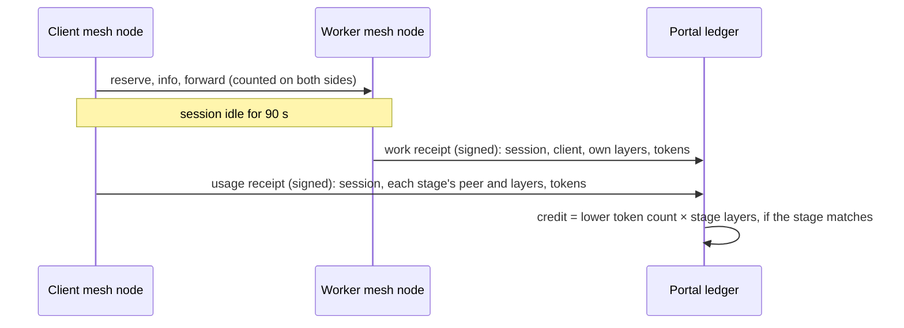

# Contribution credits

Credits make a Sangama network give-to-get: running a worker earns credits, and running inference spends them. They are a ledger kept by the portal, not money or a token. Nothing is paid out and nothing is on a blockchain.

## How work is counted

The unit is a **layer-token**: one token passed through one model layer. **One credit is 1,000 layer-tokens.** A worker serving layers 0–11 of the 24-layer model earns 12 layer-tokens per token. A client using the whole route spends 24.

Counting by work done, not by time, means a slow computer earns the same for the same layers. Credits are **conserved**: every credit a worker earns is debited from the client it served, so all balances sum to zero. There is no minting.

## Receipts

Both sides of a session report what they saw, and the portal counts only what they agree on.



- **The worker's mesh node** counts tokens that its own layers processed for each session. It bills them to the client that reserved the session, a fact the mesh already verifies.
- **The client's mesh node** counts tokens it sent through the route. It orders stages by their reservations and takes each stage's layers from that peer's own `/info` reply. One worker therefore cannot describe another worker's range.
- **Timing.** A receipt is signed once its session has been idle for 90 s, longer than any worker keeps a session, or when the node shuts down. Receipts are sent every 30 s. Metering is not on the per-token path.
- **Matching.** The portal credits a worker's claim only when the client's usage receipt names the same session, model and exact stage. It counts the lower of the two token numbers, and the client is debited the same amount.
- **Duplicates.** Each session has one receipt per signer, so a resubmitted receipt changes nothing.

Receipts are verified against the signer's peer key. The signer must hold a current membership with the right role: `worker` for work receipts, `client` for usage receipts.

## Allowance

Set `CREDIT_ALLOWANCE` (whole credits) on the portal to enforce credits. The portal then publishes a standing every 30 s: the balance of each admitted member, signed by the membership authority. Workers refuse a new reservation with `402` when the client's balance is at or below minus the allowance. New members start at zero, so the allowance is the free usage each person gets before they contribute.

Without `CREDIT_ALLOWANCE`, receipts are still recorded and balances shown, but nothing is refused. Enforcement also fails open: if a node has no current standing, for example because the portal is unreachable, reservations proceed. Losing the ledger never stops inference; losing membership still does.

## Accounts

Worker and client roles use different peer keys. Link a person's peers to their portal account so one balance covers both. Earlier sessions are included.

```sh
sangama-portal link-peer <peer-id> <username>   # or the /admin form: "Link peer to account"
sangama-portal credits                            # balances and unconfirmed work
```

Signed-in members see their account balance on `/account`.

## What this does and does not prevent

| Attempt | Outcome |
|---|---|
| Worker inflates its token count or layer range | Not credited beyond what the client confirms |
| Head worker rewrites the trace to shrink another stage | No effect: stage ranges come from each peer's own info |
| Client withholds its usage receipt | Worker is not credited for that session; the portal lists it under "Unconfirmed work" by client, for the operator to act on |
| Same person pays themselves (linked peers) | Balance change nets to zero |
| Two members trade fake sessions | Zero-sum: one gains exactly what the other loses |
| Replayed receipt | Ignored (one receipt per session and signer) |
| Worker returns garbage instead of computing | **Not detected yet.** Needs spot re-runs or hidden test inputs (next stage) |

Credits depend on the operator's invitations for Sybil resistance: each admitted identity gets one allowance. Treat balances as fairness accounting inside a trusted group, not as a value store. Do not pay money against them until computed results are checked.

## Limits

- The receipt format supports routes of up to eight stages and models of up to 1,024 layers. Only the pinned 24-layer Qwen model is supported today, so every layer-token is priced the same.
- The outbox holds up to 1,024 unsent receipts per node while the portal is unreachable.
- Each peer may submit 5,000 receipts per day.
- On Ctrl-C or SIGTERM a node signs every metered session, finished or not, and spends up to 4 s sending them. Receipts are lost only if the node is killed outright (SIGKILL, power loss) or the portal is unreachable at that moment.
- Verified with native processes (`scripts/test-credits-local.py`: allowance refusal, account linking, replay, forgery and shutdown reporting) and in the Docker simulation (two-worker route matching and zero-sum balances).
